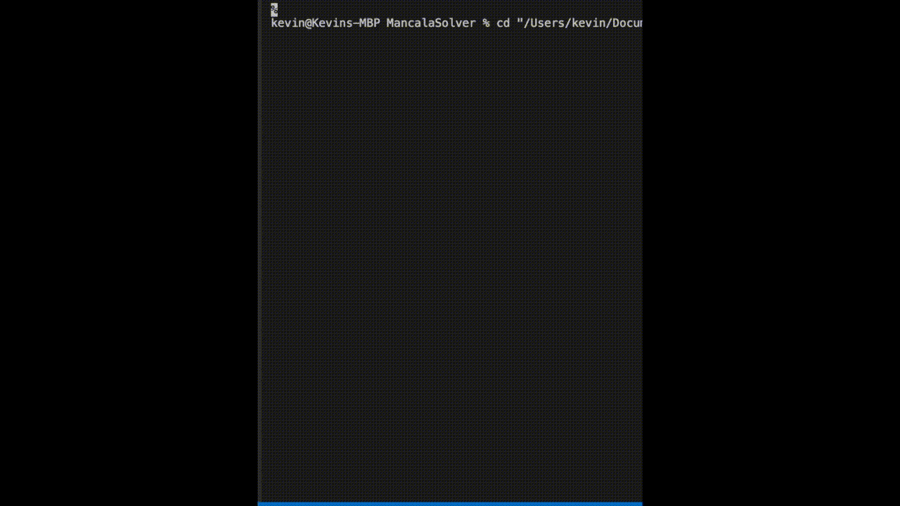

# MancalaSolver

## DEMO

### Description
This project is based on an interest that I explored with Game Theory. The game is Mancala and the objective is to collect as many pieces onto your side and to have a higher score by the end of the game. The minimax algorithm with backtracking is a game solving decision rule that I explored in Java. I also implemented the alpha-beta pruning optimizations as well as game specific optimizations. Two game modes were implemented including avalanche and capture.
